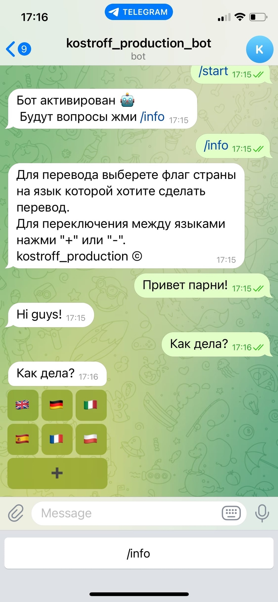
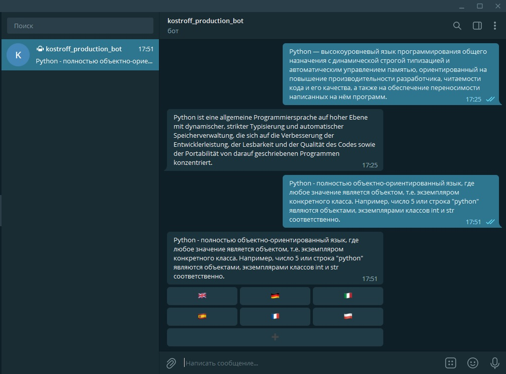

# Бот переводчик для телеграмм
### О приложении
Приложение «Бот Переводчик» умеет переводить тексты более чем с 20 языков. 
Перевод осуществляет сторонним сервисом yandex через выделенное API. 
Начало работы как у любого бота через команду /start, так же добавлена кнопка информации. 
### Установка.
Загрузите приложение на сервер через гит, предварительно установив все зависимости. 
`git clone https://github.com/Kostrov-Producsion`
 
 
Получить информацию по API можно тут [cloud.yandex.ru](https://cloud.yandex.ru/docs/translate/quickstart)
 
 
После запускаем скрипт на сервере. 
Для запуска скрипта в директории с файлом напишите: 
`python -i bot.py`
### Screenshots app
 &nbsp;&nbsp;&nbsp;&nbsp;&nbsp;&nbsp;&nbsp;&nbsp;&nbsp;&nbsp; 
